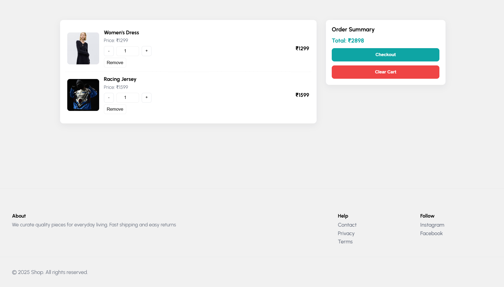

# 🛒 E-Com Simulation

A modular, lightweight e-commerce frontend simulation built using **HTML, CSS, and JavaScript**.
Features include dynamic product rendering, persistent cart management, and reusable UI components (navbar, footer, etc.), making it ideal for learning or prototyping e-commerce flows.

---

## 📸 Demo Screenshots


### 🏠 Homepage


### 🛍 Product Listing


### 🛒 Cart View



---

## 🚀 Features

### ✔ Product System

* Centralized `data.js` file for product list.
* Automatic product card generation.
* Easy scalability: add new products by editing one file.

### ✔ Shopping Cart

* Persistent cart using **localStorage**.
* Add/remove/update items.
* Auto-calculated totals.

### ✔ 100% Client-Side

* No backend required.
* Perfect for beginners and static hosting (GitHub Pages, Netlify, Vercel).

---

## 🔧 Setup & Usage

1. **Clone the repo**

```bash
git clone https://github.com/armansingh24/ecommerce-simulation.git
cd ecommerce-simulation
```

2. **Open `index.html` in a browser**
   No build tools needed.

3. (Optional) Use Live Server for better development workflow.

---

## 🌐 Deployment

You can host this project easily on:

* **GitHub Pages**
* **Netlify**
* **Vercel**
* **Any static hosting service**

---

## 🤝 Contributing

Contributions are welcome!
Ideas for improvement:

* Search bar for products
* Category filters
* Dark mode theme
* Product detail page

---

## 📜 License

MIT License — free for personal and commercial use.
